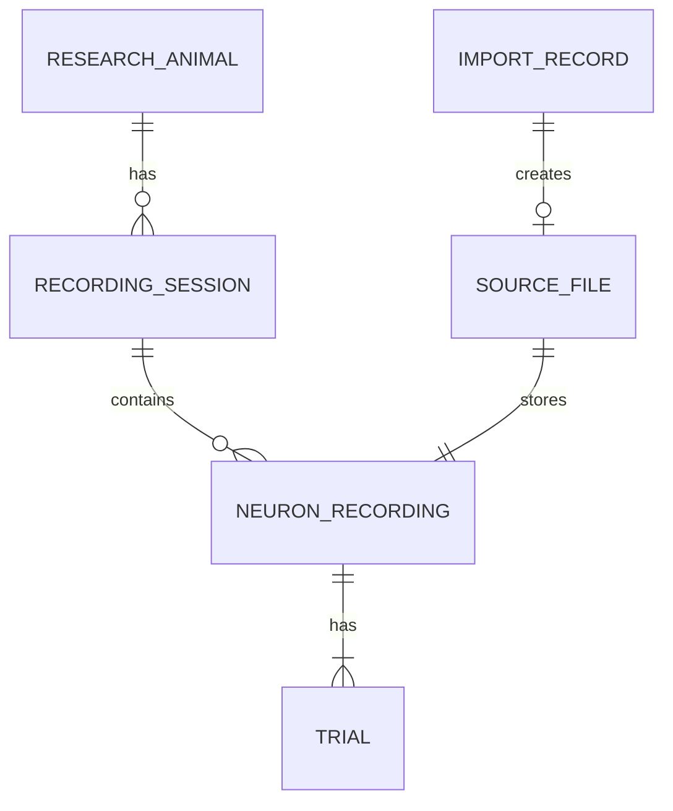

# 数据库与本地文件存储设计 v1

状态：可供实现的设计草案；尚未创建数据库、执行迁移或导入数据。字段契约见 [data-contract-v1.md](data-contract-v1.md)。沿用仓库已规划的 PostgreSQL；本阶段不锁定软件版本。

## 1. 实体关系



只有完成导入的记录进入业务表；ImportRecord 包括成功、失败、跳过及重复尝试。一次成功导入创建一个 SourceFile 和一个 NeuronRecording；重复尝试只留诊断，不创建新的 SourceFile。

## 2. 表与字段

### research_animal

- id：UUID 主键。
- code：text，非空、唯一；来自文件名前三个字母，使用精确大小写比较。
- created_at：timestamptz，系统创建时间，不代表采集时间。

### recording_session

- id：UUID 主键。
- animal_id：非空外键 → research_animal。
- session_number：integer，来自文件名三位 session 序号。
- UNIQUE(animal_id, session_number)。不创建未提供的采集日期。

### source_file

- id：UUID 主键。
- import_record_id：非空唯一外键 → import_record。
- original_filename、original_file_name、save_file_name：text，非空，分别保存外部名称和两项内部名称。
- sha256：64 位十六进制字符串，非空、全局唯一。
- storage_key：text，非空唯一；内部相对路径，不使用用户提供的路径。
- byte_size：bigint，非空且大于 0。
- contract_version、parser_version：text，非空。
- source_structure：jsonb，保存 MAT 变量类型、原始形状等解析描述；不放 raster 数组。
- created_at：timestamptz。

### neuron_recording

- id：UUID 主键。
- session_id：非空外键 → recording_session。
- source_file_id：非空唯一外键 → source_file。
- neuron_number：bigint，非空全局唯一；解析时校验整数值及可表示范围，不静默溢出或取整。
- experiment_type_name、training_phase_name、brain_area_name：非空 text。
- experiment_type、training_phase_number、brain_area_number：非空 bigint。
- trial_count：integer，CHECK > 0。
- sample_count：integer，CHECK = 6001。
- sample_interval_us：integer，CHECK = 1000；显式保存已确认的 1 ms 约定。

### trial

- recording_id：非空外键 → neuron_recording。
- trial_index：integer，CHECK >= 1；与原始矩阵行号一致。
- PRIMARY KEY(recording_id, trial_index)。
- stimulus_position_name、second_stimulus_position_name：text，非空，CHECK 限定九种位置。
- is_match_trial：boolean，非空，CHECK 与两位置相等的布尔表达式一致。
- cue_sample_interval_length、cue_reward_interval_length：double precision，非空；不声称单位为秒。保留源双精度数值，不转十进制文本后再舍入。
- raster 行通过 recording → source_file 和 trial_index 定位；不复制到 Trial JSON。

试次数量、trial_index 连续性及标签对齐由导入程序在事务内校验（1..trial_count），不误称普通 CHECK 可以验证跨行数量。非有限时间数值可在数据库原样保存；将来 API 以明确结构表示，禁止输出非法 JSON NaN token。

### import_record

- id：UUID 主键。
- received_filename：text。
- sha256：可空 text，计算完成后填入；不唯一，允许记录重复尝试。
- status：RECEIVED / VALIDATING / IMPORTING / SUCCEEDED / REJECTED / SKIPPED / FAILED。
- contract_version、parser_version：text。
- started_at、finished_at：timestamptz；进行中 finished_at 可空。
- report：jsonb，结构遵循数据契约；非有限值采用显式字符串描述。
- staging_key：可空 text，恢复清理使用。

首版不将 session、animal 或科学数据作级联删除；外键默认阻止误删。用户身份与项目授权由后续权限设计接入，多人服务开放前必须完成，当前命令行导入设计不代表已有权限隔离。

## 3. 字段映射

| 来源 | 目标 |
|---|---|
| 外部文件名前三字母、随后三位数字 | research_animal.code、recording_session.session_number |
| 外部名称、内部 original_file_name/save_file_name | source_file 三个名称字段 |
| raster_site_info.neuron_number | neuron_recording.neuron_number |
| raster_site_info 实验/训练/脑区名称及编号 | neuron_recording 对应六个字段 |
| raster_data.shape | neuron_recording.trial_count/sample_count |
| 用户确认 1 ms | neuron_recording.sample_interval_us = 1000 |
| raster_labels 三个逐 trial 数组 | trial 两个位置字段及 is_match_trial |
| timing_info 两个逐 trial 数组 | trial 两个 double precision 字段 |
| raster_data 本体与所有原始结构 | 本地原始 MAT 文件，通过 source_file.storage_key 关联 |

## 4. 存储决策与理由

采用“PostgreSQL 保存可查询信息，本地原 MAT 保存完整矩阵和源结构”。因此数据进入的是数据库与受控文件组成的存储系统，不表示所有 0/1 都进入 SQL 表。

第一版直接读取原 MAT 中的 raster_data；不同时生成第二份 NPZ 缓存，减少必须保持一致的副本。若实际查询性能需要，再引入可重建的数组缓存。备份和恢复必须同时覆盖数据库及原文件。

```text
DATA_ROOT/
  staging/<import_uuid>/source.mat
  originals/<source_file_uuid>/source.mat
```

DATA_ROOT 通过配置提供。staging 与 originals 位于同一文件系统，以支持重命名发布。原始名称仅保存为元数据；读取、下载通过资源 ID 查询 storage_key，不接收任意磁盘路径。

## 5. 写入、并发与恢复

1. 建立 ImportRecord，上传到专属 staging；计算 SHA-256，执行格式及字段验证。
2. 对不支持 variant 标记 SKIPPED；校验失败、重复内容或编号标记 REJECTED；不创建业务记录。
3. 标记 IMPORTING。在数据库事务内创建/关联 animal 和 session，创建 source_file、neuron_recording、trial；依赖 UNIQUE 约束处理并发，不只做预查询。
4. 将临时文件移动到本次 source_file_uuid 专属位置。任何清理操作只操作本次创建的路径，不能删除已存在记录的文件。
5. 在事务内读取刚写入的全部字段；重读正式文件、核对 SHA-256 与完整矩阵，比较所有字段和 trial 顺序。
6. 同一事务将 ImportRecord 标记 SUCCEEDED 并提交。业务查询只见已提交记录。
7. 失败则回滚业务事务，另行记录 FAILED/REJECTED，并清理本次临时/孤立文件。

文件系统与 PostgreSQL 不共享事务。文件移动后进程崩溃可能留下孤立文件：启动恢复程序检查超时导入，在确认无活跃导入后，按 source_file 引用关系清理或隔离孤立目录。提交结果不明确时必须重新查询数据库，不能先删文件；SUCCEEDED 且存在引用的文件必须保留。具体锁与超时机制在导入实现中完成并测试。

## 6. 索引与验收

- 唯一索引：animal code、animal/session、neuron_number、sha256、source_file_id、storage_key。
- 普通索引：neuron_recording.session_id、import_record(status, started_at)。实验分类索引等到实际查询需求再添加。
- 三个样例从空库成功后：3 animals、3 sessions、3 recordings、3 source files、432 trials；这一数量仅适用于本次选择的三个样例。
- 逐项读回与源解析结果一致，包括浮点值、位置、match、完整 raster 和文件字节校验和。
- 重复/改名上传业务表行数不变；并发同一编号最多成功一次。
- 错误矩阵/标签/身份拒绝；模拟移动失败、数据库失败、提交前崩溃与提交结果不明确，验证恢复不会误删成功文件。

## 7. 下一步实现交付

1. Python 数据契约模型与只读解析验证命令。
2. SQLAlchemy 模型和首次 Alembic 迁移，实现本文类型、外键和唯一约束。
3. 在空 PostgreSQL 实例运行迁移、核对约束；在受控测试库执行升级/回退验证。
4. 文件存储适配器与导入事务，最后运行三个真实样例及故障验收。

本文为设计交付，不将尚未运行的迁移或数据库验收标记为完成。
